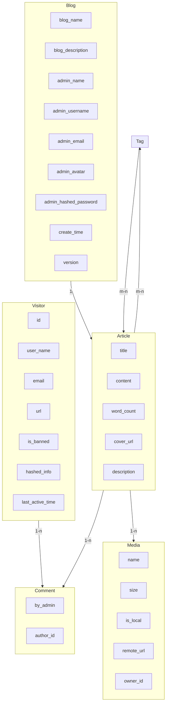

## Suika Blog System
backend purely driven by fastapi, frontend by vue. 

### Security

OAuth2 + JWT

### Cache
Redis + Beaker 

### Database

### run
you may installing the environment and run this project via `make`, or use direct `uvicorn` to run `main:app`

under developing...
